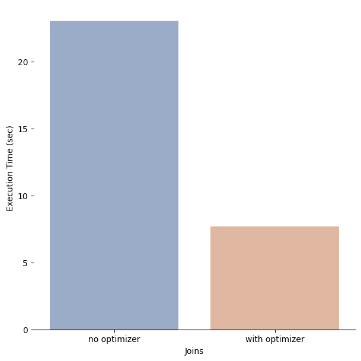

# Αναφορά Εξαμηνιαίας Εργασίας
**Μάθημα:** Προχωρημένα Θέματα Βάσεων Δεδομένων,
**Θέμα:** Χρήση του Apache Spark στις Βάσεις Δεδομένων

## Ομάδα

[Καναρόπουλος Ιωάννης Γεράσιμος](https://github.com/giannis-k) 03116016

[Κουτρούμπας Αθανάσιος](https://github.com/thanoskoutr) 03116073

## Μέρος 1ο

### Ζητούμενο 1
Μέσα από το Master VM κατεβάζουμε τα `movie_data`:
```bash
wget www.cslab.ntua.gr/courses/atds/movie_data.tar.gz
```

Κάνουμε untar τα 3 `.csv` αρχεία που περιέχονται:
```bash
tar -xvzf movie_data.tar.gz
```

Δημιουργούμε ένα φάκελο `movie_data` στο hdfs:
```bash
hadoop fs -mkdir hdfs://master:9000/movie_data
```

Μεταφέρουμε τα 3 `.csv` αρχεία σε αυτό τον φάκελο στο hdfs:
```bash
hadoop fs -put movie_genres.csv movies.csv ratings.csv hdfs://master:9000/movie_data
```

### Ζητούμενο 2
Για να μετατρέψουμε τα `.csv` αρχεία σε `.parquet` τρέχουμε το script `convert_csv_to_parquet.py` που γράψαμε πάνω στο Spark, το οποίο ορίζει το schema των δεδομένω και φορτώνει τα `.csv` σε dataframe μορφή κρατώντας το δωσμένο schema. Έπειτα τα dataframe γράφονται σε `.parquet` αρχεία μέσα στον φάκελο που δημιουργήσαμε στο hdfs:
```bash
spark-submit convert_csv_to_parquet.py > log_convert_csv_to_parquet.txt 2>&1
```

### Ζητούμενο 3

#### Ερώτημα Q1
Ψευδοκώδικας Map Reduce για την υλοποίηση με RDD API:
```
```

#### Ερώτημα Q2
Ψευδοκώδικας Map Reduce για την υλοποίηση με RDD API:
```
```

#### Ερώτημα Q3
Ψευδοκώδικας Map Reduce για την υλοποίηση με RDD API:
```
```

#### Ερώτημα Q4
Ψευδοκώδικας Map Reduce για την υλοποίηση με RDD API:
```
```

#### Ερώτημα Q5
Ψευδοκώδικας Map Reduce για την υλοποίηση με RDD API:
```
```


### Ζητούμενο 4
Στο Master VM τρέχουμε το `run_all_queries.sh` script, ώστε να τρέξει όλα τα ερωτήματα στο Spark και να αποθηκεύσει τα logs και τους χρόνους εκτέλεσης:
```bash
./run_all_queries.sh
```
Τοπικά, τρέχουμε το `plot_queries_exec_times.py` script, ώστε να δημιουργήσουμε το παρακάτω ραβδοδιάγραμμα με τους χρόνους εκτέλεσεις ομαδοποιημένους ανά ερώτημα:
```bash
./plot_queries_exec_times.py queries_exec_times.txt
```


**Σχολιασμός Χρόνων Εκτέλεσης για κάθε ερώτημα.**
Παρατηρούμε ότι, για τα Q2, Q3 το RDD είναι πιο αργό από το αντίστοιχο query σε SQL. 
Αντίθετα στα Q1, Q4 το RDD είναι πιο γρήγορο από τα αντίστοιχα query σε SQL.
Για το Q5, παρατηρούμε ότι η εκτέλεση σε SQL είναι σχεδόν η διπλάσια από ότι με RDD, και αυτό γιατί στην υλοποίηση μας, κάνουμε πολλά Group By, και μετά για να μπορέσουμε να πάρουμε τις τιμές από όλα τα πεδία μιας γραμμής, χρειάζεται να κάνουμε αντίστοιχα πολλά join πινάκων, κάτι που αυξάνει όπως φαίνεται κατά πολύ τον χρόνο εκτέλεσης.
Αντίθετα στην περίπτωση του RDD API, δεν χρείαζεται όλη αυτή η επιπλέον δουλειά, καθώς ορίζουμε εμείς από το map ή το reduce ποια πεδία θα κρατήσουμε και πως.

Παρατηρούμε επίσης ότι τα Q2, Q3 είναι τα πιο χρονοβόρα ανεξάρτητα τις υλοποίησης και αυτό γιατί και τα δύο χρησιμοποιούν το `ratings` αρχείο, το οποίο είναι πολύ μεγαλύτερο των άλλων αρχείων:
- `movies.csv`: 17 MB
- `movie_genres.csv`: 1.3 MB
- `ratings.csv`: 677 MB

Επίσης προφανώς το Q5 είναι το πιο χρονοβόρο από όλα, καθώς γίνονται πολλά joins και group by, και με τα τρεία αρχεία.

Επίσης το Q2 χρησιμοποιεί μόνο το αρχείο `ratings`, ενώ το Q3, εφαρμόζει join πάνω στα αρχεία `ratings` και `movie_genres`, οπότε για αυτό είναι ακόμα πιο αργό.


**Τι παρατηρούμε με την χρήση του parquet;**
Για τις SQL υλοποιήσεις παρατηρούμε ότι, όταν τρέχουμε τα ερωτήματα με τα `.parquet` αρχεία έχουμε πάντα μικρότερο (έως και μισό) χρόνο εκτέλεσης σε σχέση με τα αντίστοιχα `.csv` αρχεία.
Το parquet είναι ένα columnar storage format, το οποίο είναι συμπιεσμένο άρα έχει μικρότερο αποτύπωμα στη μνήμη και στον δίσκο και βελτιστοποιεί το I/O, μειώνοντας τον χρόνο εκτέλεσης.
Επίσης διατηρεί επιπλέον πληροφορίες (metadata) για το dataset και μπορεί να διατηρήσει και το schema που μπορεί να έχουν τα δεδομένα. Οπότε είναι λογικό να έχει καλύτερες επιδόσεις από το να χρησιμοποιούμε απλά text formats όπως το CSV.


**Γιατί δεν χρησιμοποιούμε `infer schema` με την χρήση του parquet;**
Όπως αναφέραμε το parquet έχει την δυνατότητα να διατηρεί το schema των δεδομένων, οπότε όταν μετατρέψαμε στην αρχή τα `.csv` δεδομένα μας σε `.parquet` αρχεία, ορίσαμε και περάσαμε ως παράμετρο τότε το schema των δεδομένων. Αυτό το schema παρέμεινε και όταν τρέχαμε τα ερωτήμα, οπότε γλιτώσαμε και χρόνο, καθώς για το τρέξιμο στα `.csv` αρχεία, έπρεπε κάθε φορά να ορίζουμε το schema για το κάθε αρχείο-πίνακας.


## Μέρος 2o

### Ζητούμενο 1
`broadcast join` στο RDD API (Map Reduce)
**ΚΩΔΙΚΑΣ?**
### Ζητούμενο 2
`repartition join` στο RDD API (Map Reduce)
**ΚΩΔΙΚΑΣ?**
### Ζητούμενο 3
Στο Master VM τρέχουμε το `create_movie_genres_100.py` με παράμετρο το `movie_genres.csv`:
```bash
./create_movie_genres_100_local.py movie_genres.csv
```
Αυτό απομονώνει τις 100 πρώτες γραμμές του αρχείου `movie_genres.csv` και τις αποθηκεύει στο `movie_genres_100.csv` τοπικά καθώς και στο hdfs.

Στο Master VM τρέχουμε το `run_all_joins.sh` script, ώστε να τρέξει τα δύο joins (`broadcast`, `repartition`) του πίνακα `movie_genres_100` και του `ratings` στο Spark και να αποθηκεύσει τα logs και τους χρόνους εκτέλεσης:
```bash
./run_all_joins.sh
```

Χρόνοι Εκτέλεσης των 2 joins:
```bash
join_broadcast.py: 74.14392161369324 seconds
join_repartition.py: 1089.001785993576 seconds
```

**Τι παρατηρείται? Γιατί?**

### Ζητούμενο 4

#### Απενεργοποίηση optimizer και εκτέλεση
Χρησιμοποιώντας το script της εκφώνησης, συμπληρώσαμε τα path των parquet πινάκων στο hdfs, καθώς και την επιλογή για να μπορέσουμε να απενεργοποιήσετε την επιλογή του join από το βελτιστοποιητή. Αυτή ήταν η παρακάτω:
```python
spark.conf.set("spark.sql.autoBroadcastJoinThreshold", -1)
```
η οποία στην ουσία απενεργοποιεί το broadcasting, οπότε τα μόνα join που γίνονται είναι από την μεριά του reduce.

Στο Master VM τρέχουμε το `run_all_optimizer.sh` script, ώστε να τρέξει τα 2 join μεταξύ των πινάκων `movie_genres` και `ratings` στο Spark, με ή χωρίς τον optimizer και να αποθηκεύσει τα logs και τους χρόνους εκτέλεσης:
```bash
./run_all_optimizer.sh
```

#### Πλάνα Εκτέλεσης
Το πλάνο εκτέλεσης για το **join χωρίς τον optimizer**:
```
== Physical Plan ==
*(6) SortMergeJoin [movieId#8], [movieId#1], Inner
:- *(3) Sort [movieId#8 ASC NULLS FIRST], false, 0
:  +- Exchange hashpartitioning(movieId#8, 200)
:     +- *(2) Filter isnotnull(movieId#8)
:        +- *(2) GlobalLimit 100
:           +- Exchange SinglePartition
:              +- *(1) LocalLimit 100
:                 +- *(1) FileScan parquet [movieId#8,genre#9] Batched: true, Format: Parquet, Location: InMemoryFileIndex[hdfs://master:9000/movie_data/movie_genres.parquet], PartitionFilters: [], PushedFilters: [], ReadSchema: struct<movieId:int,genre:string>
+- *(5) Sort [movieId#1 ASC NULLS FIRST], false, 0
   +- Exchange hashpartitioning(movieId#1, 200)
      +- *(4) Project [userId#0, movieId#1, rating#2, timestamp#3]
         +- *(4) Filter isnotnull(movieId#1)
            +- *(4) FileScan parquet [userId#0,movieId#1,rating#2,timestamp#3] Batched: true, Format: Parquet, Location: InMemoryFileIndex[hdfs://master:9000/movie_data/ratings.parquet], PartitionFilters: [], PushedFilters: [IsNotNull(movieId)], ReadSchema: struct<userId:int,movieId:int,rating:double,timestamp:string>
```
Το πλάνο εκτέλεσης για το **join με τον optimizer**:
```
== Physical Plan ==
*(3) BroadcastHashJoin [movieId#8], [movieId#1], Inner, BuildLeft
:- BroadcastExchange HashedRelationBroadcastMode(List(cast(input[0, int, false] as bigint)))
:  +- *(2) Filter isnotnull(movieId#8)
:     +- *(2) GlobalLimit 100
:        +- Exchange SinglePartition
:           +- *(1) LocalLimit 100
:              +- *(1) FileScan parquet [movieId#8,genre#9] Batched: true, Format: Parquet, Location: InMemoryFileIndex[hdfs://master:9000/movie_data/movie_genres.parquet], PartitionFilters: [], PushedFilters: [], ReadSchema: struct<movieId:int,genre:string>
+- *(3) Project [userId#0, movieId#1, rating#2, timestamp#3]
   +- *(3) Filter isnotnull(movieId#1)
      +- *(3) FileScan parquet [userId#0,movieId#1,rating#2,timestamp#3] Batched: true, Format: Parquet, Location: InMemoryFileIndex[hdfs://master:9000/movie_data/ratings.parquet], PartitionFilters: [], PushedFilters: [IsNotNull(movieId)], ReadSchema: struct<userId:int,movieId:int,rating:double,timestamp:string>

```

#### Ραβδοδιάγραμμα
Τοπικά, τρέχουμε το `plot_optimizer_exec_times.py` script, ώστε να δημιουργήσουμε το παρακάτω ραβδοδιάγραμμα με τους χρόνους εκτέλεσεις για τα δύο joins με ή χωρίς τον optimizer:
```bash
./plot_optimizer_exec_times.py optimizer_exec_times.txt
```



#### Σχολιασμός Χρόνων Εκτέλεσης για κάθε join
**Τι παρατηρείτε? Εξηγείστε**